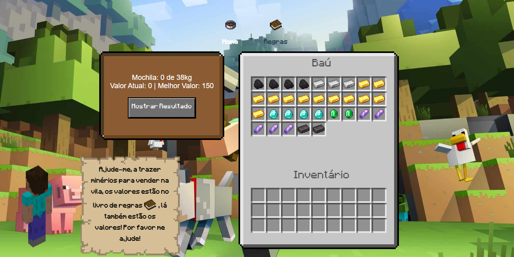
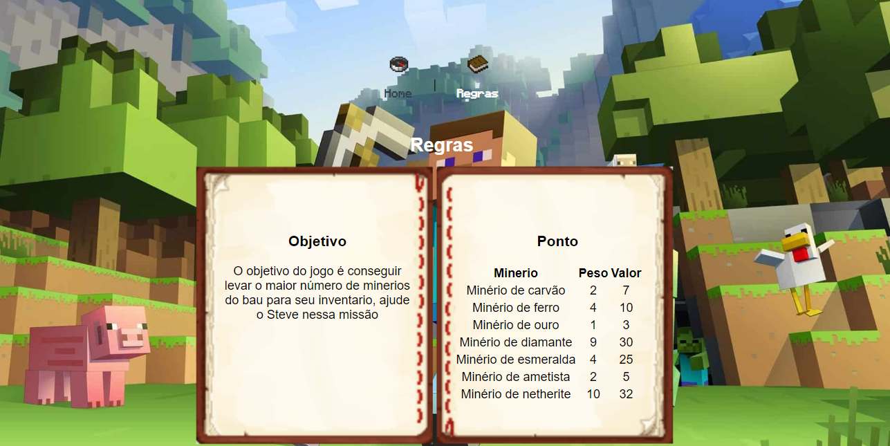

Tema:

- PD

# Ajude o Stive

## Alunos

| Matrícula | Aluno                     |
| ---------- | ------------------------- |
| 200018060  | Gabriel Ferreira da Silva |
| 200044567  | Weslley Alves de Barros   |

Dupla 06

## Sobre

Este projeto, consiste ajudar a Steve, a carregar o máximo de minérios possível para seu inventário(mochila), com o melhor aproveitamento para que ele possa vender com sucesso, e fugir de catástrofes. Esse projeto utiliza os conceitos do Algoritmo da Mochila com Porgramação Dinâmica.

---

## Screenshots



---

## Instalação

**Linguagem**: Javascript`<br />`
**Framework**: VueJS

## Requisitos

**Node versão**: 16`<br />`
**NPM**: 8.15

## Uso

Explique como usar seu projeto caso haja algum passo a passo após o comando de execução.

Passo a passo para rodar o projeto

```bash
npm i
npm run serve
```

ou acessar pelo [link](https://projeto-de-algoritmos.github.io/PD_AjudeSteve/)

[Video](https://github.com/projeto-de-algoritmos/PD_AjudeSteve/tree/main/assets)
